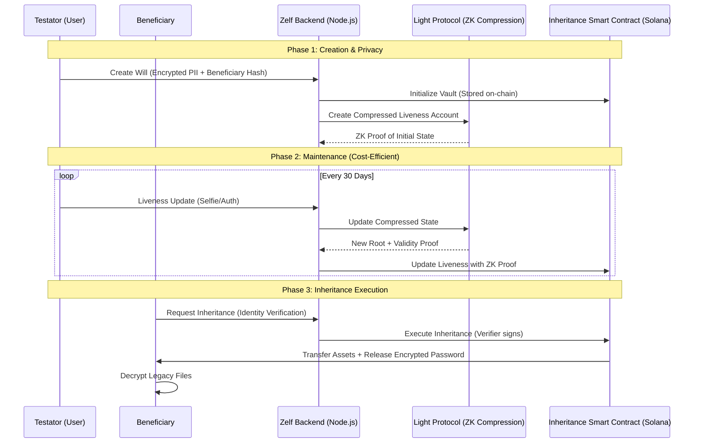

# 🛡️ Zelf Legacy: Private Heritage on Solana

### *Secure, Private, and Cost-Effective Inheritance powered by Light Protocol ZK Compression*

[](https://solana.com/es/privacyhack)
[](https://www.lightprotocol.com/)

---

## 📖 Overview

**Zelf Legacy** is a decentralized inheritance protocol that solves the "Dead Man's Switch" problem without compromising user privacy. By leveraging **Light Protocol's ZK Compression**, Zelf enables testators to maintain a "Proof of Life" on-chain at a fraction of the cost of traditional state, while keeping sensitive beneficiary data and asset details completely private through Zero-Knowledge proofs and selective disclosure.

## 🏗️ Architecture & Flow

The following diagram illustrates how Zelf Legacy utilizes Light Protocol to maintain privacy and efficiency:



## 🔐 Privacy-First Features

- **ZK-Compressed Liveness**: Instead of storing every liveness heartbeat in expensive account data, we use Light Protocol to compress the "Proof of Life" history into a single ZK-root.
- **Beneficiary PII Hashing**: Sensitive data like emails and Document IDs are NEVER stored in plain text. We use SHA-256 hashing to ensure only the rightful owner can verify their identity.
- **Encrypted Legacy Vaults**: The access keys to inheritance files are stored as encrypted blobs, only decryptable by the beneficiary after a successful on-chain execution.
- **Selective Disclosure**: No one on the network knows who the beneficiary is or what assets are being inherited until the "Proof of Death" (timeout) is triggered.

## 🛠️ Technology Stack

- **Smart Contract**: Anchor (Solana) with custom Light Protocol verification logic.
- **Backend (this repo)**: Node.js / Express with `@lightprotocol/stateless.js`.
- **Privacy**: Zero-Knowledge Proofs for state validity and SHA-256 for identity masking.
- **Storage**: ZK Compression for minimized on-chain footprint.

## 🚀 Hackathon Implementation Details

During the **Solana Privacy Hack**, we focused on:
1. **Real ZK Compression**: Moving from standard Solana accounts to compressed accounts for liveness tracking.
2. **Identity Obfuscation**: Implementing the hashing layer for all beneficiary metadata.
3. **Photon Integration**: Using the Photon RPC to index and retrieve compressed liveness accounts for the testator.

---

## ⚙️ Development & Setup

For technical instructions on how to run the components of this project, please refer to the following guides:

- **[Backend Setup Guide](app/README.md)**: Node.js server, API documentation, and Light Protocol integration.
- **[Smart Contract Guide](RUN_SMART_CONTRACT.md)**: Building, testing, and deploying the Anchor program.

### Quick Start (Backend)
```bash
cd app
npm install
npm start
```

---

*Built with ❤️ for the Solana Privacy Hack 2026.*
